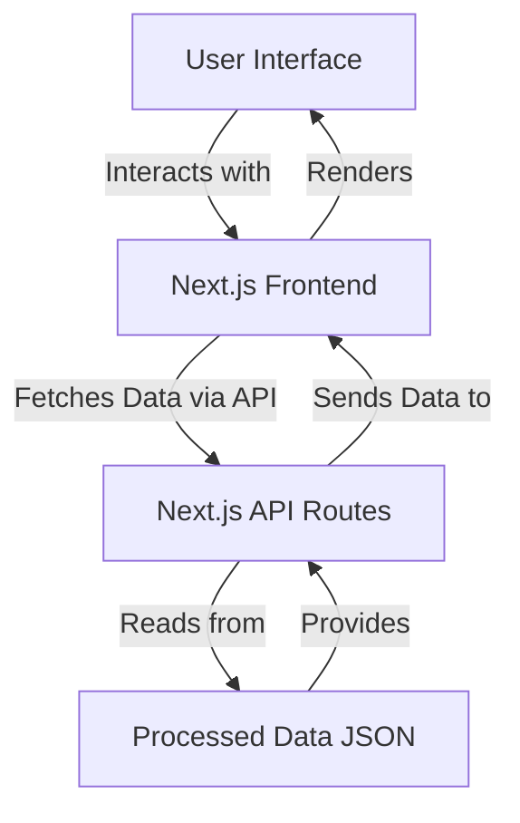

# UniDash — PYQ Analyzer

Welcome to **UniDash — PYQ Analyzer**, a powerful tool designed to help students analyze and predict questions for their exams. Built with Next.js, this application offers an intuitive interface for selecting subjects and generating question predictions based on processed data.

## Table of Contents

- [Features](#features)
- [Architecture](#architecture)
  - [Architecture Overview](#architecture-overview)
  - [Data Flow](#data-flow)
- [Project Structure](#project-structure)
- [Getting Started](#getting-started)
- [Technologies Used](#technologies-used)
- [Deployment](#deployment)
- [Contributing](#contributing)
- [License](#license)

## Features

- **Dynamic Subject Selection:** Choose from a list of subjects fetched dynamically from processed data.
- **Question Prediction:** Generate random questions based on the selected subject with confidence scores.
- **Progress Indicators:** Visual feedback during the prediction process to enhance user experience.
- **Responsive Design:** Optimized for both desktop and mobile devices.
- **Seamless Navigation:** Intuitive navigation menus and dropdowns for easy access to various sections.
- **Extensible Architecture:** Easily add more features and components as needed.

## Architecture

### Architecture Overview

UniDash — PYQ Analyzer follows a **client-server architecture** leveraging Next.js for both frontend and backend functionalities. The application is structured to ensure scalability, maintainability, and efficiency.



### Data Flow

The **data flow** within the application ensures that user interactions result in appropriate data fetching and rendering without unnecessary delays or data inconsistencies.

```mermaid
mermaid
sequenceDiagram
participant User
participant Frontend
participant API
participant DataStore
User->>Frontend: Select Subject
Frontend->>API: GET /api/subjects
API->>DataStore: Read subjects from processed_data.json
DataStore-->>API: Return subjects
API-->>Frontend: Send subjects
Frontend-->>User: Display subjects in DropdownMenu
User->>Frontend: Click "Predict Next Questions"
Frontend->>API: GET /api/random-question?subject=selectedSubject
API->>DataStore: Filter questions by subject and select random
DataStore-->>API: Return random question with confidence
API-->>Frontend: Send prediction data
Frontend-->>User: Display Predicted Questions
```

## Project Structure

Understanding the project's structure is crucial for navigating and contributing effectively. Here's an overview of the key directories and files:

├── public/
│ ├── globe.svg
│ ├── window.svg
│ ├── vercel.svg
│ ├── next.svg
│ ├── file.svg
│ ├── favicon.ico
│ └── ...
├── src/
│ ├── app/
│ │ ├── api/
│ │ │ ├── subjects/
│ │ │ │ └── route.ts
│ │ │ └── random-question/
│ │ │ └── route.ts
│ │ ├── components/
│ │ │ ├── question-predictor/
│ │ │ │ └── predictor.tsx
│ │ │ └── ui/
│ │ │ ├── button.tsx
│ │ │ ├── dropdown-menu.tsx
│ │ │ ├── navigation-menu.tsx
│ │ │ └── ...
│ │ ├── globals.css
│ │ ├── layout.tsx
│ │ ├── page.tsx
│ │ └── ...
│ ├── python/
│ │ └── data/
│ │ └── processed_data.json
│ └── ...
├── .gitignore
├── next.config.ts
├── package.json
├── tsconfig.json
├── tailwind.config.ts
├── postcss.config.mjs
├── README.md
└── 


- **public/**: Contains static assets like images, icons, and the favicon.
- **src/app/**: Holds the main Next.js application files, including:
  - **api/**: API routes for fetching subjects and random questions.
  - **components/**: Reusable React components, further categorized into specific directories.
  - **globals.css**: Global CSS styles.
  - **layout.tsx**: Defines the application's layout structure.
  - **page.tsx**: The main page component.
- **src/python/data/**: Stores the processed data in `processed_data.json`.
- **Configuration Files**: `tsconfig.json`, `tailwind.config.ts`, `postcss.config.mjs`, etc., manage TypeScript, Tailwind CSS, and PostCSS configurations respectively.
- **README.md**: This documentation file.

## Getting Started

Follow these steps to set up the project locally:

### Prerequisites

- **Node.js**: Ensure you have Node.js installed. You can download it from [here](https://nodejs.org/).
- **npm or yarn**: Package managers for handling dependencies.

### Installation

1. **Clone the Repository**

   ```bash
   git clone https://github.com/your-username/unidash-pyq-analyzer.git
   cd unidash-pyq-analyzer
   ```

2. **Install Dependencies**

   Using npm:

   ```bash
   npm install
   ```

   Or using yarn:

   ```bash
   yarn install
   ```

3. **Run the Development Server**

   ```bash
   npm run dev
   # or
   yarn dev
   ```

4. **Open in Browser**

   Navigate to [http://localhost:3000](http://localhost:3000) to view the application.

## Technologies Used

- **Next.js**: React framework for server-side rendering and building scalable web applications.
- **React**: JavaScript library for building user interfaces.
- **TypeScript**: Superset of JavaScript providing static typing.
- **Tailwind CSS**: Utility-first CSS framework for rapid UI development.
- **Radix UI**: Primitives for building accessible React components.
- **Lucide Icons**: Open-source icon library.
- **MermaidJS**: For creating diagrams and flowcharts (used here in documentation).
- **Vercel**: Platform for deploying Next.js applications.

## Deployment

Deploy your application seamlessly using Vercel:

1. **Push to GitHub**

   Ensure your project is pushed to a GitHub repository.

2. **Connect to Vercel**

   - Go to [Vercel](https://vercel.com/).
   - Sign in and import your GitHub repository.
   - Follow the prompts to configure your project.

3. **Deploy**

   Once connected, Vercel will automatically build and deploy your application. Future pushes to the repository will trigger automatic deployments.

For detailed instructions, refer to [Next.js Deployment Documentation](https://nextjs.org/docs/app/building-your-application/deploying).

## Contributing

Contributions are welcome! Follow these steps to contribute:

1. **Fork the Repository**

2. **Create a Feature Branch**

   ```bash
   git checkout -b feature/YourFeatureName
   ```

3. **Commit Your Changes**

   ```bash
   git commit -m "Add your message"
   ```

4. **Push to the Branch**

   ```bash
   git push origin feature/YourFeatureName
   ```

5. **Open a Pull Request**

## License

This project is licensed under the [MIT License](LICENSE).
